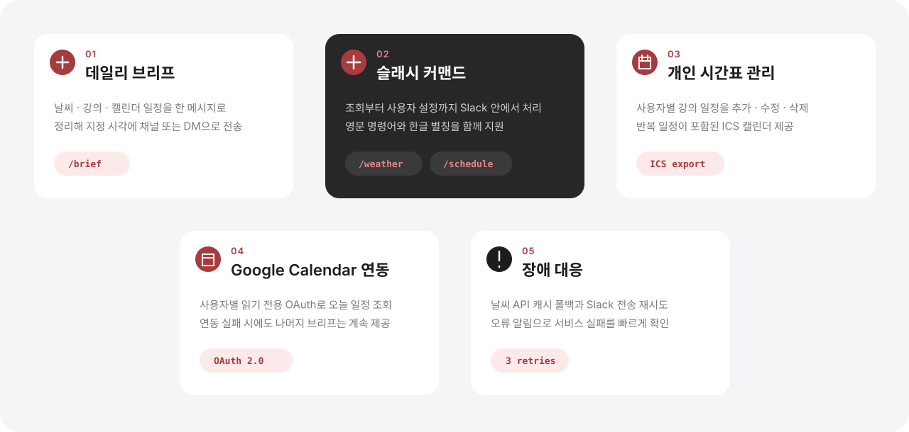

# Slack Weather & Schedule Bot

날씨·강의 시간표·Google Calendar 일정을 지정 시각에 Slack으로 보내는 개인 일정 봇입니다. Slack 명령어로 시간표를 관리하고 ICS 캘린더로 구독할 수 있습니다.

## 프로젝트 소개

<p align="center">
  
</p>

### 핵심 기능

<p align="center">
  
</p>

### 시스템 아키텍처

<p align="center">
  
</p>

이 구조는 소규모 팀에서도 배포와 운영을 단순하게 유지하면서, Slack 명령 처리·예약 브리프·ICS 제공을 역할별로 분리하기 위해 선택했습니다.

또한 SQLite와 PostgreSQL을 함께 지원해 로컬 개발과 운영 환경을 같은 코드베이스로 대응하고, 외부 API 연동을 모듈화해 변경과 장애 대응이 쉽도록 구성했습니다.

### 서비스 화면

<p align="center">
  
</p>

### 팀 구성

<table>
  <tr><td align="center"><a href="https://github.com/ken-jeong"></a></td><td><b>정상겸</b><br/><sub>Leader · Backend</sub></td><td>프로젝트 설계 · 시간표 기능 · 사용자 설정 · 테스트 · 문서</td></tr>
  <tr><td align="center"><a href="https://github.com/eyes25"></a></td><td><b>김준서</b><br/><sub>Backend · Infra</sub></td><td>스케줄러 · Google Calendar 연동 · DB · 배포</td></tr>
  <tr><td align="center"><a href="https://github.com/Rustica0411"></a></td><td><b>안현빈</b><br/><sub>Backend</sub></td><td>Slack App 연동 · 슬래시 커맨드 · Block Kit 메시지</td></tr>
</table>

## 기술 스택

<p align="center">
  
  
  
  
  
  
</p>

Python · Slack Bolt · FastAPI · APScheduler · SQLite / PostgreSQL

의존성은 [requirements.txt](requirements.txt)에서 관리합니다.

## 시작하기

코드와 문서를 하나의 저장소에서 관리합니다. 실행 코드·테스트·CI는 루트에, 요구사항·설계·배포 안내는 `docs/`에 있습니다. 아래 명령은 모두 저장소 루트에서 실행합니다.

### 사전 요구사항

- Python 3.11 이상
- Slack App과 OpenWeatherMap API 키
- [Slack App 설정](docs/reference/deploy.md#2-slack-app-설정)에 따른 토큰·권한·명령어 등록

### 설치 및 실행

`.env.example`을 복사한 뒤 [환경 변수 안내](docs/reference/deploy.md#환경-변수)의 필수값을 입력한 뒤 실행합니다.

```bash
python -m venv .venv
source .venv/bin/activate
python -m pip install -r requirements.txt
cp .env.example .env
python main.py
```

Windows에서는 가상환경 활성화에 `.venv\Scripts\Activate.ps1`을 사용합니다.

### 환경 변수

필수값과 선택 설정은 [환경 변수 안내](docs/reference/deploy.md#환경-변수), 초기 파일은 [.env.example](.env.example)을 참고합니다.

### 배포 · 운영

Oracle Cloud Always Free VM에서 systemd로 상시 실행하고, nginx가 Slack 이벤트와 ICS API 요청을 각 포트로 전달합니다.

`main` 브랜치에 푸시하면 GitHub Actions가 Python 3.11 · 3.12 · 3.13에서 테스트를 실행하고, 통과한 커밋만 서버에 자동 배포합니다.

설정·배포·운영 절차는 [배포 가이드](docs/reference/deploy.md)를 따릅니다.

## 사용 방법

### 명령어

| 명령어 | 설명 |
| --- | --- |
| `/weather [도시]` | 현재 날씨와 강수확률 |
| `/schedule [오늘\|내일\|YYYY-MM-DD]` | 날짜별 시간표 |
| `/schedule 추가 <요일> <시작> <종료> <과목> [장소] [교수] [메모]` | 일정 추가 |
| `/schedule 수정 <ID> <field=value>...` | 일정 수정 |
| `/schedule 삭제 <ID>` | 일정 삭제 |
| `/schedule 목록` | 등록한 개인 일정과 ID 조회 |
| `/config [도시] [HH:MM] [timezone]` | 알림 설정 조회·변경 |
| `/brief` | 날씨·시간표·캘린더 즉시 조회 |
| `/bot-help` | 도움말 |

`/날씨`, `/시간표`, `/설정`, `/브리핑`, `/도움말`과 `/날씨1` 같은 숫자 접미 별칭도 지원합니다.

```text
/시간표 추가 월 09:00 10:30 알고리즘 공학관401호 박교수
/시간표 수정 12 room="공학관 301호" start=10:00
/설정 Seoul 07:00 Asia/Seoul
```

### 캘린더 연동

Google Calendar 연결은 [사용자별 OAuth 인증](docs/reference/deploy.md#3-google-calendar-선택)을 따릅니다.
시간표를 외부 캘린더에서 구독하려면 ICS API 주소를 등록합니다.

```text
http://localhost:3000/calendar/{slack_user_id}.ics?token={CALENDAR_ACCESS_TOKEN}
```

원격 구독 시 `localhost:3000`을 배포 서버 주소로 바꿉니다. 연결 오류는 [트러블슈팅](docs/reference/deploy.md#7-트러블슈팅)을 참고합니다.

## 테스트

```bash
python -m pip install -r requirements-dev.txt
python -m pytest -q
```

자동 검증 설정은 [CI 워크플로](.github/workflows/ci.yml)를 참고합니다.

## 관련 문서

[요구사항](docs/spec.md) → [구현 계획](docs/plan.md) → [작업 현황](docs/tasks.md) 순서로 확인합니다.

| 문서 | 내용 |
| --- | --- |
| [spec.md](docs/spec.md) | 요구사항·동작 계약·완료 기준 |
| [plan.md](docs/plan.md) | 구현 방향·검증 전략 |
| [tasks.md](docs/tasks.md) | 진행 현황·남은 작업 |
| [deploy.md](docs/reference/deploy.md) | Slack App·OAuth 설정, 배포·운영·트러블슈팅 |
| [작업 지침](AGENTS.md) | 문서별 역할·변경 원칙 |
